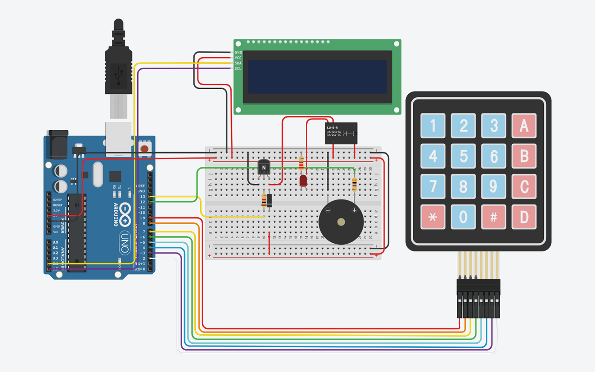

# Project 6 - KeyPad Locker

    

## Components
<table>

<tr>
 <th>Count</th>
 <th>Component</th>
</tr>
<tr>
    <td>1</td>
    <td>Arduino Uno R3</td>
</tr>
<tr>
    <td>1</td>
    <td>Transistor 2N2222</td>
</tr>
<tr>
    <td>1</td>
    <td>SPDT Relay</td>
</tr>
<tr>
    <td>1</td>
    <td>220Ω Resistor</td>
</tr>
<tr>
    <td>1</td>
    <td>300Ω Resistor</td>
</tr>
<tr>
    <td>1</td>
    <td>1 kΩ Resistor</td>
</tr>
<tr>
    <td>1</td>
    <td>Diode</td>
</tr>
<tr>
    <td>1</td>
    <td>LED Diode</td>
</tr>
<tr>
    <td>1</td>
    <td>Keypad 4x4</td>
</tr>
<tr>
    <td>1</td>
    <td>Piezo</td>
</tr>
<tr>
    <td>1</td>
    <td>PCF8574, 39 LCD 16 x 2 (I2C)</td>
</tr>
</table>